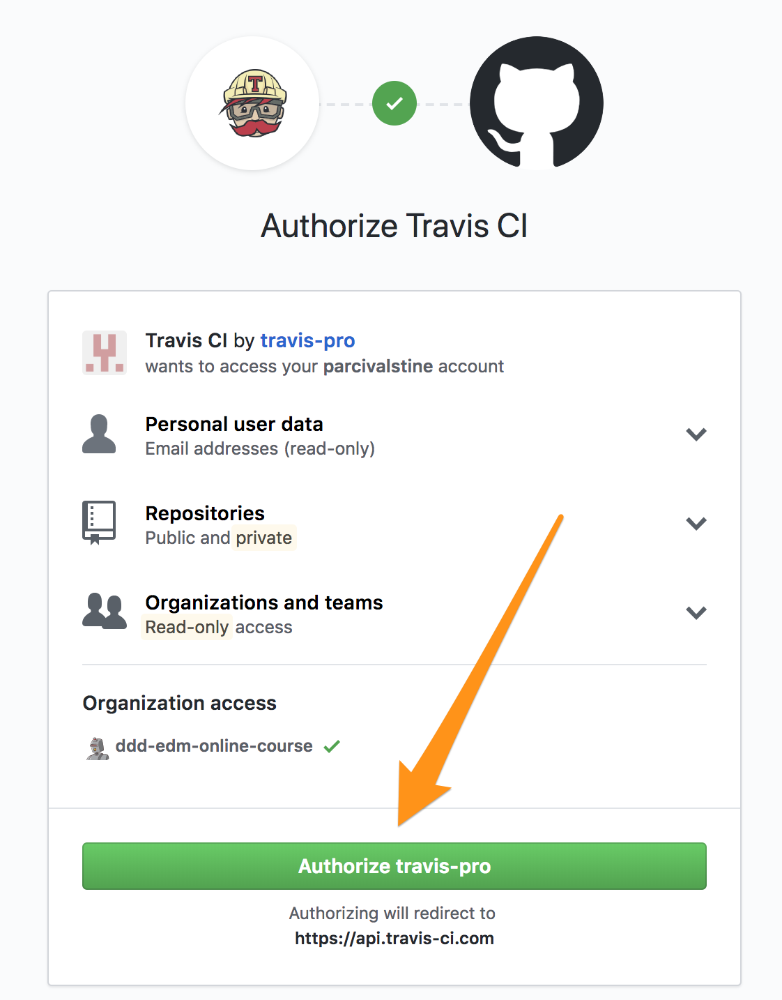
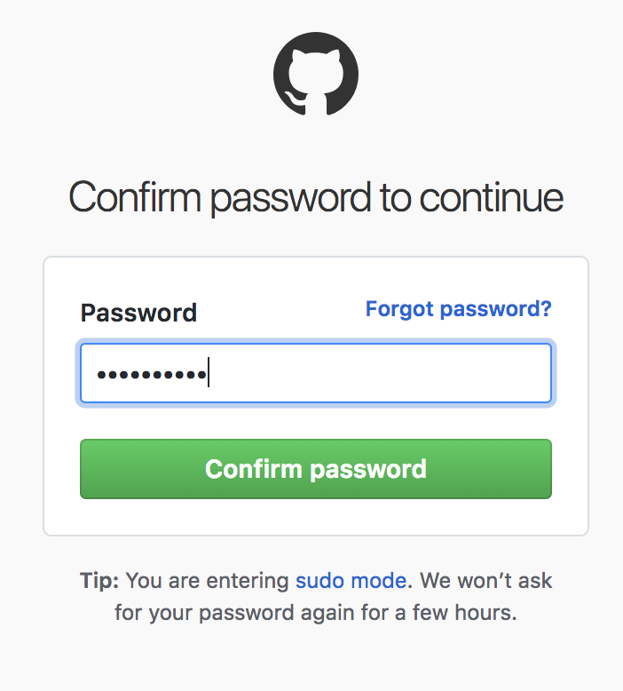
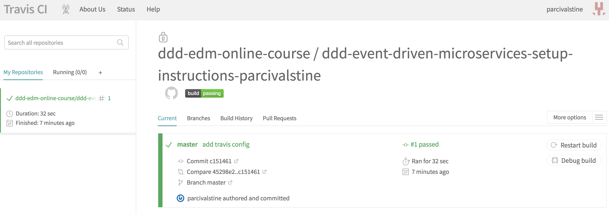

= Domain-Driven Design and Event-Driven Microservices

**Learning a Pathway to Evolutionary Architecture**

== Welcome to the Lab Environment!

You have now successfully acquired your own private copy of the lab exercises and instructions.
This is your sandbox, and you can feel free to make changes, commit and push those changes, etc.
You'll also find guidance here on how to complete the labs and run the tests. Happy coding!

WARNING: While this is *your* repository, please don't make changes to any of the implemented code that already has passing tests during the labs.
If you break that code, you may not be able to successfully complete the labs.

== Setup Guide

If you've gotten this far, we can safely assume that your Git/GitHub setup is correct.
All that remains is to import the code into your IDE of choice and run your first tests.

NOTE: While IDE choice should not matter, these instructions have only been tested in IntelliJ IDEA.

. Ensure your workstation has a proper Java 8 installation.

. You will need to make sure your IDE is properly configured for Lombok.
At the following links, you can find instructions for https://projectlombok.org/setup/eclipse[Eclipse] and https://projectlombok.org/setup/intellij[IntelliJ] IDEA.

. Import `pom.xml` as a Maven project into your IDE.

. Run `com.mattstine.dddworkshop.pizzashop.suites.SetupSuite` to demonstrate that all of the implemented tests are passing.

. Assuming you've gotten this far, you're ready to submit your setup lab. Read on!

== Lab Submission Guide

Now we'll ensure that you are properly setup for submitting completed labs to GitHub and viewing your results in TravisCI.

NOTE: While submission of your lab implementations is entirely optional, it will help your instructor gauge everyone's progress, as well as provide him the opportunity to provide custom feedback in your repository!

. Find `com.mattstine.lab.setup.HelloWorldTest`. This test should currently be failing.

. Make it pass!

. Change the `script` property in `.travis.yml` to read: `mvn test -B -P FirstSubmission`

. You'll now want to commit your changes to Git. When submitting labs, please prefix your commit with `[NAME OF LAB]` in order to make it easier to track down.
For this lab, you'll prefix with `[SETUP]`. For Lab 1, you'll prefix with `[LAB 1]`. And so on...

. Push your changes to GitHub.

. Visit http://travis-ci.com, and sign in with your GitHub account. If you are not already a Travis CI user, you will need to complete the following steps.
+
image::assets/travis.png[]

. You will be asked to authorize Travis CI to access data from your GitHub account. You will have to accept to continue. If you are not comfortable with this authorization, you will be able to complete the labs (if you're here, I assume you've cloned the repo), but you won't be able to submit for feedback.
+

. You may be asked by GitHub to confirm your password.
+

. Travis CI will sync any enabled repos in your GitHub account. Your class repo should already be there as well, and should have a successful build.
+

. Assuming you've gotten this far, you're ready to start Lab 1!

== Lab Guides

TODO: these need to be written

* link:docs/lab1.adoc[Lab 1] - TDD Aggregate Root - Create Kitchen Commands with Business Logic and Invariants
* link:docs/lab2.adoc[Lab 2] - TDD Aggregate Root - Create and Publish Kitchen Domain Events
* link:docs/lab3.adoc[Lab 3] - TDD Aggregate Repository - Create Kitchen Repositories and Add Domain Events
* link:docs/lab4.adoc[Lab 4] - TDD Aggregate Repository - Rehydrate Kitchen Aggregates by Reference
* link:docs/lab5.adoc[Lab 5] - TDD Policy - Subscribe to a Kitchen Domain Event from within an Aggregate and Create CQRS View
* link:docs/lab6.adoc[Lab 6] - TDD Application Service - Expose Kitchen Business Interface and Implement Transactions
* link:docs/lab7.adoc[Lab 7] - TDD Policy - Subscribe to a Kitchen Domain Event from an Adjacent Aggregate and Update State
